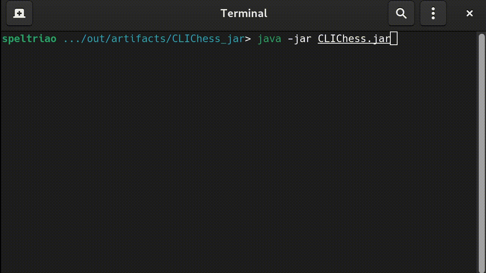

# CLI-Chess
### Fully functional Comand Line Chess written in Java.


<p><b> To run: </b></p>
```
java -jar CLIChess.jar
```

<p><b> Features: </b></p>
<p> -> Include all moves (including <i>En Passant</i>, Castling and Promotion)</p>
<p> -> Shows all possible moves for the selected piece</p>
<p> -> Multiplatform<br></br></p>

### Example:


